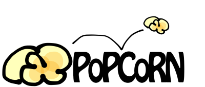

Prediction of potential causal regulatory networks
Perl script to find links between a master regulator and misregulated genes (eg from a microarray)

This script takes as input:
1. A network of known interactions. This can be generated however appropriate, but the input format should be a sif file, tab-separated, one interaction per line:
eg. ENSMUSG00000000078      upregulates     ENSMUSG00000020377      source
The only interactions the script recognises are "upregulates" and "downregulates", but it can handle multiple gene combinations, eg microarray data from a double gene knockout. In that case, the IDs should be separated by ;
2. A list of misregulated gene IDs and the misregulation value eg a fold change, one per line, tab-separated.
3. A list of genes at which the algorithm stops, with an indication of whether those genes are up- or downregulated (ie for a knockout, the value would be -1).
These genes will be not be checked for upstream regulators. Use one gene per line, with the value separated by a tab (same format as the misregulated genes).
It's fine if the stop genes are also in the misregulation list, but their expression values should be in concordance - ie if you have a knockout, but the misregulation is positive (an upregulation), something about your data needs checking.
Source is simply where the data came from (eg ArrayExpress, or a PubMed ID)

Optional inputs:
--prefix=TMP (default) - this prefixes all the output files with the specified prefix
--short - if this is included, the output network will consist of only the shortest paths between each misregulated gene and the stoplist. Default is off.
--debug - outputs what the script is doing. Off by default.
--targets - hardwires the direction of regulation of immediate downstream targets of stoplist in appropriate direction, rather than allowing their misregulation to be determined by the algorithm taking other gene$

The output is an internally consistent network linking one or more regulators with their known misregulated genes, as experimentally observed, in sif format.
A list of weightings is also output, containing both the known misregulation values and predictions for genes whose misregulation is not known. For example:
X upregulates Y.
X is known to be downregulated, with a fold change of -4.
Y is therefore also predicted to be downregulated, and will be given a predicted weighting of -1.
The file will contain the following lines: 
X     -4      known
Y     -1      predicted
This can be used with Cytoscape to colour known and predicted nodes as required.
A list of interactions with sources supporting each - this can be used with Cytoscape to add information to the edges
The final output is a list of unused IDs, which are the genes from the microarray which couldn't be included in the network.
